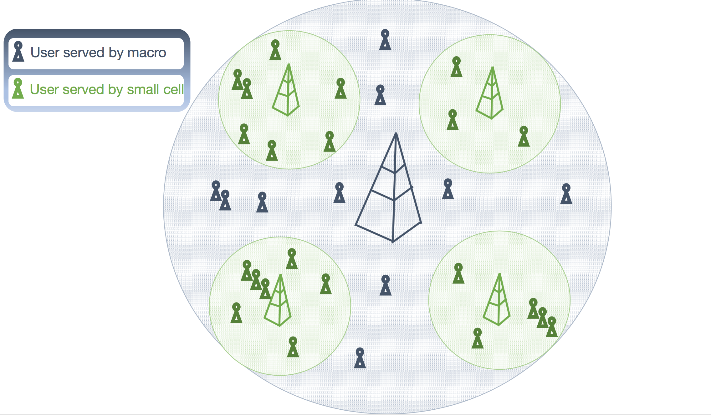

## Introduction

This repo provides a python simulation package for energy-aware load balancing of 
user traffic in 5G hetrogeneous networks.  As depicted in the
following figure, the network consists
of a single Macro cell and a number of small cells. Users generate elastic data traffic 
according to a Poisson arrival process, and they are served by either the macro or one of 
the small cells in their vicinity. Small cells provide higher
data rate to users within their coverage area, but they can also be turned off 
to save energy when demand is low. Thus the task is to develop a dynamic load (un)balancing 
policy that creates energy saving opportunities by offloading user traffic to macro 
cell whenever appropriate. More specifically, the target is to minimize 
energy consumption under a given performance constraint (mean response time).
The problem at its core is a sequential  decision making (small cell or macro) problem,
which can be modeled as a *Constrained Markov Decision Process (CMDP)*.

# Converting constrained optimization to unconstrained
The constrained optimization problem

can be reformulated as an unconstrained weighted sum optimization using the [Lagragian
multiplier](https://en.wikipedia.org/wiki/Lagrange_multiplier), where  is 
the set of dynamic policies, *E[T]* denotes mean response time, and *E[P]* represents mean power
consumption. The resulting Lagrangian multiplier can then be iteratively
updated by applying techniques like gradient descent to minimize the weighted sum of performance
and energy.

## Inputs
*Macro cell input parameters:* Idle power, busy power, service rates for its own users (blue black in the above figure) and 
users offloaded from small cells (green).

*Small cell input parameters:* Idle, busy, setup, and sleep power consumption values. Service rate, setup time (time it takes 
to start the small cell from a sleep state), and idle timer. The number of small cells can also be arbitrarily set.

## Outputs
The outputs are: **mean response time** and **mean power consumption** under the optimized policy.

## How to run the simulator
To run the simulator in a supercomputing environment as a batch job, use the [param_values.py](simulator/param_values.py) script to 
generate input parameters and the [./automated-runs.py](simulator/automated-runs.py) script to run the simulator. Simulation results are printed as comma separated values to standard output or to file.

On the other hand, to run the simulator for a single set of parameters in interactive mode, run [./single-runs.py](simulator/single-run.py) or see the available options by running *./single-run.py -h* in the command line. 

Finally, for anyone interested in the implementations. The simulator consists of the six classes in [core](simulator/core).

*Cell*:Is the core abstract class for both small and macro cells \\
*MacroCell* Inherits basic methods and attributes from *Cell* and adds more methods and attributes specific
to the macro cell.\\
*SmallCell* Inherits basic methods and attributes from *Cell* and adds more methods and attributes specific
to the small cell.\\
*Job*: A job is something the network is something the network is expected to handle such as elastic 
data traffic. It has key attributes like 'arrival time', 'remaining size' and 'origin'.\\
*TraffGenerator*: A traffic generator class for both macro and small cells. Initiats an instance of the
Job class and 'dispatches' it to a macro or small cell depending on system state and the active dispatching method.\\
*Controller*: Initiallizes all the required instances from the above class and dictates how the simulation evolves.

   

## Computational complexity
Computational complexity is the reason for buidling a simulator instead of directly computing numerical values for the MDP based load balancer. That is, to make forwarding decisions load balancing algorithm needs to dynamically keep track of the number of requests in each cell and each cell's energy mode. Numerical values can be solved for small systems consisting few number of small cells along with the macro cell. However, the "curse of dimensionality" quickly kicks in for any reasonablly sized system. Code for solving a system of one small cell and one macro cell is given in [solitary-small-cell](simulator/solitary-small-cell). 
